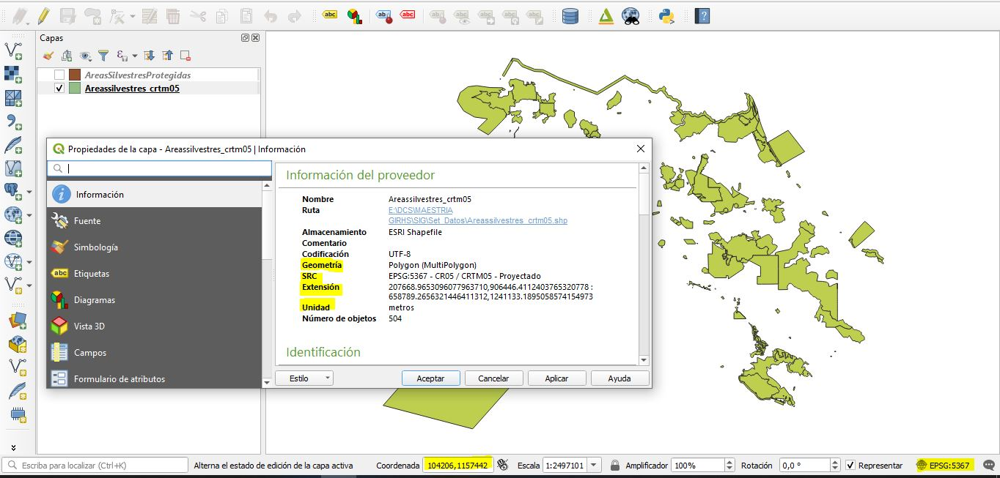

# Práctica de markdown de Fernando nivel 1
## Práctica de markdown de Fernando nivel 2
###### Práctica de markdown de Fernando nivel 6

<h1>Encabezado HTML de nivel 1</h1>
<h2>Encabezado HTML de nivel 2</h2>
<h6>Encabezado HTML de nivel 6</h6>

*Fernando Bermúdez-Kuminev*

**Nació en Costa Rica**
\
> Agua y Energía no son mercancía

RedLAR-2012
\
# Páginas de Ministerios de Salud en Centroamerica
[1- Ministerio de Salud de Costa Rica](https://www.ministeriodesalud.go.cr/)  
[2- Ministerio de Salud de Nicaragua](https://www.minsa.gob.ni/index.php?option=com_content&view=article&id=1002&Itemid=163)  
[3- Ministerio de Salud de Panamá](http://www.minsa.gob.pa/)  

